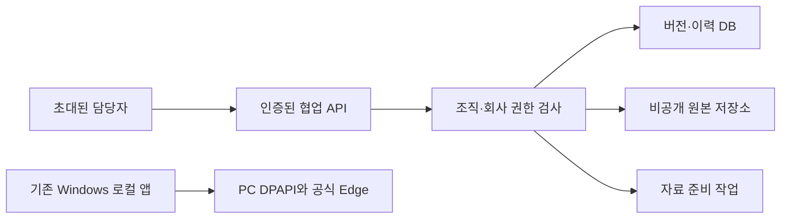

# 공유 서비스 전환 검토안

작성일: 2026-09-25. 상태: **결정과 후속 개발 범위 검토안**. 공유 서비스 구현·외부 가입·유료 자원 생성·실제 자료 이전·공개 배포는 수행하지 않았다.

## 1. 권장 기본 방향

현재 로컬 앱을 그대로 인터넷에 공개하지 않는다. 첫 공유 서비스는 **초대받은 내부 담당자의 회사별 자료·원고·업무·기관 수기 기록 협업**으로 한정하는 안을 권장한다. 벤처인 자격정보와 Edge 실행은 해당 Windows PC에 유지하고, 첫 서버 버전에서는 공식 실행 기능을 제공하지 않는다.

후속으로 공식 연동이 필요할 때만 인증된 로컬 실행기를 별도 개발한다. 서버가 임의 스크립트나 URL을 PC에 전달하는 원격 제어 구조는 채택하지 않는다. 사용자가 PC에서 대상 회사·항목·원본·전송 가능성을 검토하고 그 자리에서 승인한 제한 명령만 처리하는 구조를 검토한다.

이 권장은 현재 코드의 데이터 모델·Windows 의존성·공식 입력 안전 경계를 고려한 설계 판단이다. 운영 사업자·인증 공급자·배포 업체를 선정하거나 기관 연동 이용조건을 확인했다는 의미는 아니다.

| 전환안                                 | 장점                                | 추가 부담                                                               | 판단                      |
| -------------------------------------- | ----------------------------------- | ----------------------------------------------------------------------- | ------------------------- |
| 로컬 유지                              | 현재 자료·DPAPI·직접 인증 흐름 유지 | 여러 사용자의 동시 협업 불가                                            | 전환 전 기본 운영 유지    |
| 초대형 협업 서버 + 공식 실행은 기존 PC | 협업과 기관 자격정보를 분리 가능    | 조직 권한·서버 저장소·이전 도구 필요                                    | 첫 공유 버전 권장         |
| 협업 서버 + 인증된 PC 실행기           | 협업 이후 공식 화면 작업 연결 가능  | 장치 등록·명령 승인·취소·장애 시 중복 실행 방지 필요                    | 별도 후속 단계            |
| 서버에서 계정 보관·기관 브라우저 실행  | 중앙 운영 가능성                    | Windows 대화형 인증·보안 모듈·계정 공유 권한·세션 격리 검증이 새로 필요 | 현재 코드로 운영하지 않음 |

## 2. 현재 코드와 충돌하는 지점

| 현재 근거                                         | 현재 보장                                                    | 공유 서비스에서 필요한 변경                                                                                           |
| ------------------------------------------------- | ------------------------------------------------------------ | --------------------------------------------------------------------------------------------------------------------- |
| `web/package.json`, `studio-http.ts`              | 127.0.0.1 바인딩과 localhost Host·Origin 검증                | 인증·세션·조직 권한을 먼저 구현하고 별도 서버 모드에서 명시적으로 활성화. 로컬 검사를 단순 삭제하지 않음              |
| `studio-storage.ts`                               | 설치별 SQLite, `studio_cases.id`로 회사 조회, 회사 CAS       | 인증 주체와 조직에 귀속된 회사인지 모든 읽기·쓰기·다운로드에서 서버가 검사. 현재 `caseId`는 접근 권한이 아님          |
| `StudioStore.list()`                              | 설치에 저장된 모든 기업 목록                                 | 조직·멤버십 범위 필터. 목록·요약·검색·집계에서도 다른 조직 회사 존재가 노출되지 않음                                  |
| `originals/{caseId}/{sourceId}.bin`과 안전 reader | 로컬 회사 소유·경로·링크·파일 교체·SHA 검증                  | 조직별 비공개 객체 저장소 또는 분리 파일 저장소, 불변 버전 ID·SHA·조건부 읽기. 클라이언트가 파일 경로를 지정하지 못함 |
| `venturein-vault.ts`                              | DPAPI `CurrentUser`, 회사 ID와 결합한 암호문                 | 해당 PC·Windows 사용자 범위 유지. 서버로 복사한 암호문을 서버 계정으로 풀 수 있다고 가정하지 않음                     |
| `venturein-runner.ts`                             | 프로세스의 Map에 browser/context/page, 회사별 임시 Edge 세션 | 서버 증설·다중 worker에 공유 불가. 공식 실행 worker/장치의 명시적 소유권과 장애 처리 필요                             |
| `venturein-input-lock.ts`, 실행 승인 Map          | `globalThis` 잠금·2분 단회 승인·재시작 시 승인 폐기          | 다른 프로세스까지 포함하는 권한·잠금·단회 소비. 로드밸런서 고정 연결만으로 중복 실행 방지가 되지 않음                 |
| `studio-preparation.ts`, OCR 전역 잠금            | 한 프로세스에서 같은 작업 중복 방지                          | 영속 작업·임대 소유권·기간·단계 commit. 여러 worker의 같은 회사 동시 처리 차단                                        |
| `studio-windows-ocr.ts`                           | Windows 한국어 OCR, 제한된 로컬 임시 파일·child process      | Windows 작업자 또는 별도 검증 OCR 경로. 서버 OS 변경만으로 기존 기능이 동일 동작한다고 표시하지 않음                  |
| `OPENAI_API_KEY`와 AI 호출                        | 설치 환경의 단일 설정, 사용자가 AI 모드 선택                 | 조직별 사용 권한·전송 승인·비용 한도·키 책임 구분. 새 협업 시작을 외부 AI 승인으로 간주하지 않음                      |
| 담당자 이름·수기 검토자·단계 이력                 | 담당자 표시 문자열과 서버 보관 시각                          | 로그인 사용자 ID와 표시 이름 스냅샷을 분리. 기존 문자열을 인증된 사용자로 소급 변환하지 않음                          |
| 로컬 백업 CLI                                     | 새 경로 복원·원본/DB 검증·DPAPI 제약 고지                    | 조직별 복원 권한·암호화·보존 정책·서버 작업 중 복구 일관성 및 훈련 필요                                               |

Windows DPAPI의 일반적인 복호화 범위는 암호화한 사용자 자격과 컴퓨터에 연결된다. 예외가 존재해도 현재 앱은 일반 사용자 범위를 전제로 하므로 비밀 이전 수단으로 간주하지 않는다. [Microsoft CryptProtectData 문서](https://learn.microsoft.com/en-us/windows/win32/api/dpapi/nf-dpapi-cryptprotectdata)

현재 SQLite WAL은 여러 호스트에서 하나의 네트워크 파일시스템 DB를 공유하는 배포 모델에 적합하지 않다. 첫 내부 실험을 단일 서버·단일 writer로 제한할 수는 있지만, 그 경우에도 사용자 권한 구현은 별도로 필요하다. [SQLite WAL 문서](https://sqlite.org/wal.html)

## 3. 실제 운영 전 결정 목록

아래는 지금 사용자에게 답변을 요구하는 질문지가 아니다. 개발 계획과 운영 승인서에 채워야 할 결정 목록이다. 추천값은 제안이며 확정된 운영 정책이 아니다.

| 결정             | 권장 출발점                                          | 결정 전 개발 가능한 부분                         | 외부 운영 전에 확정할 내용                            |
| ---------------- | ---------------------------------------------------- | ------------------------------------------------ | ----------------------------------------------------- |
| 이용자 범위      | 한 운영 조직의 초대받은 내부 담당자                  | 합성 조직·사용자 fixture와 권한 경계             | 내부 담당자만인지, 고객 기업 사용자도 직접 접속하는지 |
| 조직·회사 소유권 | 조직 아래 여러 회사, 사용자 멤버십으로 접근          | 조직 ID·멤버십·회사 연결 스키마                  | 회사별 분리 권한, 조직 간 이동·공동 접근 허용 여부    |
| 역할             | 관리자·작성자·검토자·조회자, 원본 다운로드 권한 별도 | 권한 매트릭스와 거부 테스트                      | 자료 열람·원본 반출·검토 완료·삭제·초대 권한 주체     |
| 인증             | 검증된 OIDC 기반 로그인, 초대제, 관리자 추가 인증    | 공급자 adapter·가상 인증·세션 만료 시험          | 인증 업체, 도메인, 실제 계정·초대 대상·관리자         |
| 저장 위치        | 협업 데이터용 관계형 DB와 비공개 원본 저장소         | 저장소 interface·합성 이관·버전/해시 검사        | 공급자·지역·비용·접근 운영자·백업 보관 장소           |
| 공식 계정        | 기존 PC의 DPAPI에 유지                               | 서버 모드에서 공식 실행 비활성 및 장치 계약 설계 | 기관 계정 이용·위임 권한, PC 실행기 필요 여부         |
| 외부 AI          | 기본은 자료 기반 모드, 명시적 선택 후 허용           | 조직 권한·사용량 상한·전송 대상 미리보기         | 계약·키 소유자·허용 자료 범위·비용 한도               |
| 원본·이력 보관   | 불변 증거와 현재 편집 자료를 구분                    | 논리 삭제·보존 잠금·복구 fixture                 | 보존기간, 회사 탈퇴·삭제 시 처리, 예외 승인자         |
| 운영 책임        | 배포·백업·복구·사고 대응 담당자 지정                 | 합성 복구 훈련·상태 점검                         | 허용 손실 시간과 복구 시간, 연락·대응 주체            |
| 공개 범위        | 비공개 시험 → 제한된 초대 운영                       | 로컬/격리 preview와 수용 시험                    | 공개 URL·실제 자료 이전·초대 발송·배포 승인           |

업무·기관 계정 이용조건과 개인정보 처리 방식은 실제 운영 형태가 정해진 뒤 해당 문서·계약을 확인해야 한다. 이 검토안은 법적 적합 판정이나 보관기간 확정이 아니다.

## 4. 최소 서버 구조와 권한 경계

초기 서버 구현은 로컬 모드를 유지한 채 별도 저장소·인증 adapter로 분리한다. 로컬 설치의 루프백 방어를 없애고 환경변수 하나로 외부 공개하는 변경은 하지 않는다.

첫 버전에서 협업 서버와 기존 공식 실행기 사이의 자동 명령 연결은 없다. 자료 내보내기나 PC 반입도 명시적으로 선택한 범위와 검증 결과를 남기는 기능으로 따로 설계한다.

### 4.1 데이터 모델

- `organizations`, `users`, `memberships`, 조직별 회사 접근 정책을 추가한다. 회사·원본·업무·실행 기록·백업 조회의 조직 ID는 인증된 멤버십에서 도출한다.
- 외부 요청의 `organizationId`, `actorId`, 검토 권한 주장만 신뢰하지 않는다. 서버가 주체와 허용 작업을 결정한다.
- 기존 `caseId`, source/plan/application/agency ID는 보존하고 조직 소유를 명시한다. 다른 조직 ID를 우연히 알았어도 접근할 수 없어야 한다.
- 회사 revision CAS와 단회 nonce의 범위를 조직·회사·작업 종류에 명시한다. 동일 nonce 재생도 현재 권한이 유효한 주체에게만 반환한다.
- 현재 사용자 이름 스냅샷은 과거 사실 표시로 보존한다. 신규 작업의 인증 주체는 별도 `actorId`와 당시 표시명으로 기록한다. 현재 `reviewedBy` 같은 문자열만으로 과거 사용자를 인증했다고 표시하지 않는다.
- 사건·제출 원본·소명·신청회차의 불변성과 legacy 미지정 상태를 유지한다. 운영 서비스로 옮겼다는 이유로 수기 기록을 기관 검증 결과로 승격하지 않는다.

### 4.2 경로별 강제 검사

목록·상세·변경뿐 아니라 원본/ZIP 다운로드, OCR preview, 준비 작업, 실행 결과, 계정 상태, 이력 조회, 삭제, 복구에도 동일한 회사 권한 검사를 적용한다. 화면 버튼 숨김은 API 권한 검사의 대체가 아니다. 작업자도 원래 요청자의 권한이 취소됐는지 부작용 직전에 다시 확인한다.

인증 세션은 탈퇴·권한 회수·비밀번호 변경 정책에 따라 폐기할 수 있어야 한다. CSRF와 허용 Origin 검사는 인증과 함께 유지한다. 인증·조직별 응답이 다른 사용자에게 캐시되지 않도록 현재 private/no-store 정책과 배포 캐시를 함께 검증한다.

인터넷 서비스 앞단에는 TLS와 요청 제한·타임아웃·크기 제한을 적용한다. Next.js의 자체 호스팅 문서도 앞단 reverse proxy를 권장하며, 이 장치 자체가 회사 접근 권한을 대신하지는 않는다. [Next.js 자체 호스팅 문서](https://nextjs.org/docs/app/guides/self-hosting)

## 5. 저장소와 작업 실행 변경

### 5.1 DB·원본

공유 운영을 목표로 한다면 서버용 관계형 DB adapter를 우선 검토한다. 초기 이관은 회사 JSON·CAS·불변 저널 의미를 보존하고, 실제 조회·동시성 요구가 생기는 데이터부터 분리한다. 기존 SQLite를 네트워크 공유 폴더에 놓아 여러 앱이 직접 열도록 만들지 않는다.

원본은 조직·회사·source ID에 귀속된 비공개 불변 버전으로 저장한다. 현재 로컬의 파일 핸들·stat 전후 검사를 원격 객체에 그대로 흉내 내지 않고, 서버가 계산한 SHA256·크기·객체 버전·조건부 읽기를 묶어 동일성을 검증한다. 저장소 ETag만을 SHA256으로 간주하지 않는다. 다운로드 직전 권한을 확인하고, 임시 링크를 쓴다면 짧은 유효기간과 대상 객체 범위를 제한한다.

업로드·DB commit 간 중단은 `staged → committed` 상태와 확인된 고아 객체 정리 정책으로 처리한다. 경로·파일명·해시·바이트가 바뀌면 기존 불변 증거를 덮어쓰지 않는다. 업로드 파일은 실행 가능한 웹 자원으로 공개하지 않으며 처리 worker의 네트워크·파일·CPU·메모리·시간 한도를 유지한다.

### 5.2 준비·OCR 작업

현재 `globalThis` Set은 HMR을 견디지만 여러 서버 프로세스가 공유하는 잠금은 아니다. 공유 서비스에서는 영속 작업 ID, 단회 요청, 작업 소유자, 만료되는 임대, 작업 세대 번호와 단계 CAS를 도입한다. 진단·분석·원고 산출물과 checkpoint는 같은 DB transaction에 기록한다.

OCR·자료 기반 준비처럼 외부 변경이 없는 작업도 중복 결과·다른 회사 결과 혼합을 막아야 한다. 취소·시간 초과 후 worker가 늦게 반환한 결과는 세대 번호와 최신 회사 버전이 맞을 때만 저장한다. 자료 본문·원본 바이트를 작업 로그나 오류 원문에 넣지 않는다.

### 5.3 공식 입력의 후속 조건

브라우저 동작과 DB commit은 하나의 transaction으로 묶을 수 없다. 잠금 만료를 이유로 다른 worker가 동일 입력을 자동 재실행하면 안 된다. 실행 중단·결과 불명은 현재처럼 보존하고, 재대조와 허용된 새 승인 경로를 거쳐야 한다.

PC 실행기를 만들 경우 다음 조건을 모두 갖춘 별도 단계로 진행한다.

1. 조직·사용자와 등록 장치의 상호 인증, 폐기 가능한 장치 권한.
2. 임의 코드·URL·경로 대신 버전이 고정된 제한 명령 종류만 허용.
3. 회사·계정·세션·문서·연결안 fingerprint·원본 SHA·요청자·장치에 결합한 짧은 단회 승인.
4. 로컬 최종 검토·승인 및 취소. 원격 요청이 계정 입력이나 기관 제출 승인으로 자동 변환되지 않음.
5. 재시작·네트워크 단절·응답 유실·worker 교체 시 중복 동작 금지와 미확인 결과 기록.
6. PC의 암호·쿠키·브라우저 프로필을 서버에 동기화하지 않음. 공지·동의·제출의 기존 경계를 유지.

기관 보안 프로그램의 서버 설치나 원격 브라우저 사용 가능성은 아직 검증하지 않았다. 이 문서만으로 관련 실행을 활성화하지 않는다.

## 6. 이전·복구·운영 기록

이전 도구는 먼저 합성 데이터로 만들 수 있다. 실제 자료 이전은 대상 조직·회사 범위·보관 장소·운영자를 확정한 뒤 별도 실행한다.

1. 현재 로컬 검증 백업을 보관한다. 원본 DB와 설정을 수정하지 않는다.
2. 선택 회사와 해당 원본·버전·불변 저널만 추출한다. DPAPI 계정 암호문, 브라우저 상태, 실행 승인 토큰은 공유 서버로 가져오지 않는다.
3. 기존 ID·nonce·부모 체인·본문/원본 SHA·revision을 비교하고 legacy 미귀속 상태를 보존한다. 이관 자체로 과거 기록의 인증 주체나 기관 확인 상태를 만들지 않는다.
4. 새 저장소에 복원하고 독립 검증한다. 검증 전 현재 사용 데이터 경로를 바꾸지 않는다.
5. 전환 시 쓰기 중단 구간과 최종 증분 반영 방법을 정한다. 초기 버전에서 로컬·서버 양쪽 동시 편집과 자동 병합은 지원하지 않는다.
6. 되돌리기는 검증한 별도 저장소로 수행한다. 새 필드를 모르는 옛 프로그램으로 동일 DB를 편집하는 것을 복구 절차로 삼지 않는다.

운영 로그는 주체·조직·회사·행위·결과 코드·시각·요청 ID를 중심으로 기록한다. 비밀번호·키·원고 전체·OCR 본문·원본 바이트·비밀 URL은 로그에 넣지 않는다. 원본 열람·다운로드·권한 변경·삭제·복구는 감사 대상이지만, 로그의 보존기간과 접근자는 별도 결정한다.

백업은 비밀을 포함할 수 있으므로 암호화·접근 통제·수명·삭제 절차를 지정한다. 백업 성공 표시만으로 복구 가능하다고 판단하지 않고, 조직별 격리와 불변 SHA를 확인하는 별도 경로 복원 훈련을 수행한다.

## 7. 개발·승인·출시 순서

| 단계              | 내부에서 준비할 결과                                   | 실제 외부 행동 전 확인                                       |
| ----------------- | ------------------------------------------------------ | ------------------------------------------------------------ |
| A. 계약 고정      | 역할표·조직 소유·저장소/작업 interface·합성 이관       | 사용자 범위와 권한 정책 결정                                 |
| B. 비공개 개발    | mock 인증, 격리된 시험 DB/원본, 부정 테스트, 복구 계획 | 외부 서비스 가입·유료 자원·실제 도메인 설정은 별도 명시 승인 |
| C. 운영 구성 검토 | 공급자별 설정안·예상 비용·배포 산출물·접근 목록        | 실제 인증 계정 연결·관리 권한 부여·운영 비밀 등록 승인       |
| D. 제한된 검증    | 합성 자료로 로그인·권한 회수·이관·복원·부하 검사       | 실제 자료 이전 범위, 초대 발송 대상, 공개 URL 승인           |
| E. 운영 전환      | 검증 결과·복구 경로·배포 diff·중단 계획 준비           | 외부 공개 배포와 운영 전환을 구체 결과 기준으로 최종 승인    |

승인을 기다려야 하는 외부 행동과 무관한 코드·합성 시험·설계는 먼저 완성할 수 있다. 문서 작성 자체는 가입·비용 발생·사용자 초대·자료 업로드·공개 배포 권한을 부여하지 않는다. 별도 외부 승인을 이유로 현재 로컬 제품 개발을 중단할 필요는 없다.

## 8. 출시 전 필수 수용 시험

- 서로 다른 두 조직의 회사·source·원고·기관 체인·신청회차 ID를 교차 제출해 모든 API와 다운로드가 거부되는지 확인.
- 조회자는 쓰기/다운로드 권한이 없으면 직접 API로도 수행하지 못하며, 퇴사·멤버십 철회 후 진행 중 작업과 기존 세션도 권한을 잃는지 확인.
- 여러 worker의 같은 nonce·동일 revision 동시 요청에서 결과가 한 번만 저장되고 다른 payload 재생이 충돌하는지 확인.
- 작업 소유권 만료·서버 종료·commit 직후 응답 유실에서도 원고/이력이 중복 생성되지 않는지 확인.
- 저장소 객체 교체·같은 크기 변조·버전 변경·다운로드 직전 권한 회수 시 이전 SHA의 원본이라고 반환하지 않는지 확인.
- 현재 private 응답이 프록시·CDN·서버 렌더링 캐시를 통해 다른 사용자에게 재사용되지 않는지 확인.
- 백업·복원·이관이 과거 제출 스냅샷과 체인을 보존하며, 현재 실행·계정 비밀·승인 토큰을 잘못 복원하지 않는지 확인.
- 공식 입력은 첫 서버 버전에서 비활성 상태인지 확인. PC 실행기를 추가한 뒤에는 만료·단절·취소·결과 불명에서 자동 재실행이 없음을 별도로 검증.
- 실제 부하에서 정한 동시 사용자·파일 용량·작업 시간·복구 목표를 충족하는지 측정. 아직 처리량 수치를 보장하지 않음.

## 9. 현재 결론과 보류 범위

초대형 협업 기능은 독립 개발할 수 있다. 현재 코드를 외부 주소로 노출하거나 한 DB·DPAPI 계정을 여러 사용자가 공유하게 하는 방식은 이 전환안의 완료 조건을 만족하지 않는다.

우선 확정할 항목은 이용자 범위, 조직/회사 접근 모델, 인증 공급자와 관리자, 저장 지역·운영 비용, 공식 실행 유지 위치, 자료 이전 범위, 원본 보존·삭제 정책, 운영 책임자다. 실제 외부 계정 생성·권한 연결·자료 이전·공개 배포는 이 항목을 반영한 구체 결과를 검토한 뒤 수행한다. 현재는 결정안을 정리했으며 외부 변경은 하지 않았다.
