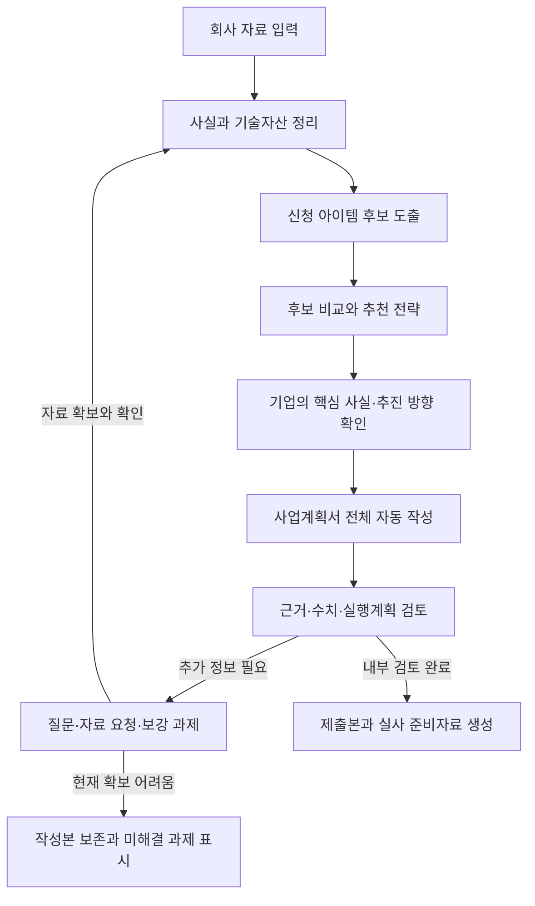

# 신청 아이템 도출·사업계획서 자동작성 상세기획

작성일: 2026-09-22  
대상: 혁신성장유형 전용 벤처확인 앱의 최우선 기능  
상태: 제품 설계안. 개별 기업의 심사나 사업계획서 작성 결과가 아니다.  
2026-09-23 추가: 이 기능에 앞서 [혁신성장유형 신청 사전진단](./혁신성장유형_사전진단_기능설계.md)을 배치한다. 기본요건, 기술·사업 준비도, 판단자료 부족을 구분하고 결과와 근거를 아이템 도출에 전달한다.

심사·실사 연결: [심사 중점·실사 준비 반영안](./혁신성장유형_심사중점_실사준비_반영안.md)에 따라 신청기술과 사업계획의 연관성, 비교 조건, 실제 개발 범위, 완료·계획 구분, 인력·자금·일정의 정합성을 확인한다. 같은 작성본의 내용·증빙·미확인 사항을 실사 준비로 이어 사용한다. 주장별 증빙 연결과 실제 제출본 확정은 후속 개발이며, 현재는 작성 항목별 인용과 준비 질문·업무를 제공한다.

## 1. 사용자가 얻어야 하는 결과

**회사의 특허·아이템·기술력·상담·사업자료를 입력하면, 그 회사가 가진 역량으로 설명하고 입증할 수 있는 신청 아이템과 사업화 방향을 추천하고, 이에 맞춘 사업계획서 전체를 자동 작성한다.**

사용자는 빈 양식의 모든 항목을 직접 작성하지 않는다. 자료를 제공하고 핵심 질문에 답하며 추천 전략과 사실관계를 확인하면, 앱이 원고·표·근거목록을 생성하고 수정사항을 전체 문서에 반영한다.

‘심사에 반드시 통과되는 수준’을 지향하는 제품 요구는 다음과 같이 구현 가능한 품질 기준으로 바꾼다.

- 적용되는 평가항목에 빠짐없이 대응하고, 신청기술과 사업계획이 연결된다.
- 핵심 사실과 차별성 주장에 적합한 근거가 연결된다.
- 기술·시장·인력·개발일정·자금계획 사이의 모순을 검토한다.
- 부족한 근거를 발견하면 추가 질문·자료 요청·실행할 보강 과제를 제시한다.
- 기업이 실사에서 실제 자료와 현재 상태로 설명할 수 있다.

혁신성장유형은 기술혁신성과 사업성장성에 대한 기관의 평가가 필요하다. 앱이 최종 통과를 보장하거나 모든 기업의 근거 부족을 문서 작성만으로 해결할 수는 없다. [공식 혁신성장유형 안내](https://www.smes.go.kr/venturein/institution/requireGuide?rgCd=C)

## 2. 핵심 처리 흐름

반복의 목적은 새로운 사실과 근거를 반영하는 것이다. 같은 자료로 문장만 계속 바꾸거나 AI끼리 동의할 때까지 반복해 품질이 높아졌다고 판단하지 않는다.

## 3. 회사 자료에서 무엇을 파악할 것인가

| 입력 | 분석할 내용 | 작성에 쓰기 전 확인 |
|---|---|---|
| 특허·지식재산 | 해결하는 문제, 핵심 구성, 실제 제품 적용 부분, 기술개발과의 관련성 | 출원·등록 구분, 권리자, 회사와의 관계, 확인된 권리상태·확인일, 양도·실시권 등 사용 근거 |
| 제품·기술·개발자료 | 기능, 구현 원리, 현재 개발 단계, 시험 조건과 결과, 개발 이력 | 자사 개발·외부 도입·공동개발 범위, 실제 구현 범위와 계획 구분 |
| 상담 녹취·대표 설명 | 고객 문제, 회사의 강점, 개발 배경, 성장 방향, 설명이 부족한 부분 | 발언 원문·시점, 객관적 자료로 확인할 부분 |
| 인력·장비·협업 | 수행 가능한 기술 범위, 개발 책임, 외부 협업 구조 | 실제 참여 인력, 보유·임차·외부 이용 구분, 협업 근거 |
| 매출·고객·시장자료 | 현재 판매제품, 고객 유형, 구매 이유, 도입 경로, 성장 가정 | 실적과 예상치 구분, 기간·단위, 신청기술과 매출의 관련성 |
| 재무·자금·일정 | 실행 가능한 개발·사업화 범위, 자금 부족 구간 | 확보자금과 조달 예정 구분, 계획 간 계산 일치 |
| 기존 신청·보완자료 | 이전 신청기술, 지적사항, 확인기간의 변화와 성과 | 신청 시점과 적용 기준, 기존 제출내용과의 일치 |

대표 개인 명의의 특허를 법인 소유로 바꾸어 표현하지 않는다. 특허 제목만으로 제품 전체의 독점성이나 모든 성능의 우수성을 단정하지 않는다. 권리·실시범위에 대한 전문 판단이 필요한 경우 확인 과제로 남긴다. 이는 신청서의 사실 확인을 위한 설계이며 특허 등록 가능성이나 침해 여부를 자동 판정하는 기능이 아니다.

## 4. 신청 아이템 도출 방식

### 4.1 후보 생성

현재 보유하거나 실제 개발 중인 기술·제품을 출발점으로 후보를 만든다. 동일 기술이라도 어느 고객의 어떤 문제를 해결하는지에 따라 신청 주제를 구체화한다. 회사의 인력·개발 이력·사업방향과 연결되는 확장계획도 함께 제안할 수 있다.

자료가 충분하면 후보 2~3개를 비교한다. 한 가지 후보만 명확하면 이를 제시하고, 현재 자료로 선정하기 어려우면 이유와 필요한 질문을 먼저 보여준다.

후보는 다음 상태를 갖는다.

| 상태 | 의미 | 문서에서 다루는 방식 |
|---|---|---|
| 현재 신청 후보 | 보유하거나 실제 개발 중이며 설명할 근거가 있는 기술 | 현재 상태와 계획을 구분해 신청 주제로 검토 |
| 근거 확인 후 후보 | 기업 설명은 있으나 관련 기술·권한·활동 자료를 추가 확인해야 함 | 미확인 쟁점과 자료 요청을 표시 |
| 향후 개발 제안 | 지금까지 수행하지 않은 새로운 확장 아이디어 | 미래 제안으로 표시하고 추진 의사·인력·자금 검토 후 계획에 반영 |

초기 개발 단계나 매출 부재 자체를 자동 제외 조건으로 삼지 않는다. 반대로 미래 제안을 이미 보유한 기술·달성한 성과처럼 사용하지 않는다.

### 4.2 후보별 전략 카드

각 후보에 대해 다음을 자동 작성한다.

1. 신청 아이템명과 한 문장 설명.
2. 목표 고객과 해결할 문제.
3. 핵심 기술·구현 원리와 회사가 수행하는 부분.
4. 보유 특허·개발자료와 아이템의 연결.
5. 현재 개발 단계와 앞으로 개발할 부분.
6. 비교 대상과 차별성, 그 근거.
7. 고객 검증·사업화 경로·수익 구조.
8. 실행할 인력·일정·자금.
9. 평가항목별 설명·증빙 상태와 부족한 부분.
10. 추천 이유, 다른 후보보다 적합한 이유, 추가 확인사항.

### 4.3 추천 판단 기준

| 비교 기준 | 판단 질문 |
|---|---|
| 실제 역량과의 연결 | 회사의 기술·개발경험·인력으로 설명할 수 있는가? |
| 기술 차별성 | 무엇이 어떤 조건에서 다른지, 근거가 있는가? |
| 고객 문제와의 연결 | 누구에게 어떤 실질적인 개선을 제공하는가? |
| 사업화 논리 | 고객 확보·도입·판매 방식이 구체적인가? |
| 실행 가능성 | 개발 범위·인력·예산·일정이 서로 맞는가? |
| 증빙 준비상태 | 핵심 설명을 뒷받침할 자료가 있거나 확보 가능한가? |
| 기업별 평가 경로 | 신규·업력·재확인 조건에 맞는 내용과 근거를 갖췄는가? |

이 기준은 제품의 추천 설명을 위한 내부 비교 기준이다. 기관의 실제 평가점수·합격선·통과확률로 표시하지 않는다. 특정 지표의 강점으로 해결되지 않은 중요한 사실 충돌을 덮지 않는다.

사용자에게 ‘왜 추천했는지’와 ‘무엇을 더 확인해야 하는지’를 함께 보여준다. 사용자가 다른 후보를 선택하면 이유와 변경 이력을 기록하고 전체 원고를 해당 주제로 다시 검토한다.

## 5. 사업계획서 자동 작성

### 5.1 전체 문서의 중심 논리

**고객의 문제 → 회사의 기술적 해결방법 → 차별성 근거 → 수행 역량 → 고객 확보와 수익 구조 → 실행 일정과 자금계획**을 한 흐름으로 연결한다.

기술·시장·자금 부분을 작성하는 과정은 동일한 기업 사실정보와 확정한 신청 전략을 참조한다. 한 부분에서 바뀐 인원·일정·매출 가정이 다른 부분에도 반영되도록 한다.

### 5.2 자동 작성 범위

- 개발 필요성, 고객의 문제와 기존 방식의 한계.
- 신청기술의 구성·작동 방식·차별성 및 비교표.
- 개발 경과, 현재 단계, 향후 개발계획과 검증 방법.
- 대표·기술인력의 역량, 연구개발 실적·투자·지식재산의 관련 내용.
- 목표시장과 고객, 경쟁제품, 시장 진입·판매·협업 전략.
- 제품·서비스의 수익 구조와 매출 계획의 가정.
- 기술개발·인력·사업화 일정과 자금 확보·조달계획.
- 재확인 대상이면 이전 확인기간의 혁신 활동과 성과.
- 항목별 증빙 목록과 실사에서 확인할 수 있는 자료.

공식 사업계획서는 온라인 작성 항목을 포함한다. 산출물은 온라인 항목별 원고, 검토용 통합본, 증빙 색인으로 구성하고 실제 신청화면의 최신 형식·분량 조건을 적용한다. [공식 제출서류 안내](https://www.smes.go.kr/venturein/institution/requireGuide?rgCd=C)

### 5.3 회사 상황에 따른 차이

| 기업 상황 | 작성 방향 |
|---|---|
| 개발 초기·매출 없음 | 현재 개발 단계와 수행 역량, 검증할 내용, 고객 접근 방법, 필요한 자금과 현실적인 일정 |
| 제품·고객·매출 존재 | 신청기술과 실제 판매·사용의 연결, 확보한 성과, 개선·확장 근거 |
| 여러 사업을 병행 | 신청기술의 범위와 관련 인력·실적을 구분하고 회사 전체 매출을 해당 기술의 실적으로 오인하지 않도록 작성 |
| 특허 중심·사업화 근거 부족 | 특허의 실제 활용과 고객 문제를 검토하고 시제품·검증·고객 확인 과제를 구체화 |
| 특허 없이 개발역량 보유 | 적용되는 평가항목에 맞춰 개발기록·제품·시험·인력·고객 등 실제 보유 근거를 활용 |
| 재확인 | 기존 신청내용과 비교해 지속적인 개발·혁신·사업성과를 설명 |

## 6. 사실·계획·추론의 관리

핵심 문장에는 다음 상태 중 하나를 붙인다. 표시 정보는 내부 검토 화면에서 관리하고 제출문은 확인된 의미에 맞춰 자연스럽게 작성한다.

| 상태 | 처리 원칙 |
|---|---|
| 증빙으로 확인한 사실 | 원본 위치·기간·단위를 연결해 작성 |
| 기업의 설명 | 발언 출처를 기록하고 중요한 주장은 추가 근거 요청 |
| 미래 계획·계산 가정 | 목표·예정·가정임을 명확히 하고 실행조건과 함께 작성 |
| 자료 간 충돌·미확인 | 제출 확정 전 검토 대상으로 남기고 조용히 한 값을 선택하지 않음 |

시장·경쟁제품 자료를 외부에서 보강하면 출처·기준일·조사범위를 기록하고 관찰 사실과 해석을 구분한다. 접근할 수 없는 자료나 찾지 못한 수치를 만들어 인용하지 않는다.

예상 매출은 단가·고객 수·판매 수량·도입 시점 등의 가정에서 계산하고, 산술 계산은 별도 계산 로직으로 검증한다. 실적 자료와 전망표를 구분하며 회사 전체와 신청기술 관련 실적의 범위를 표시한다.

## 7. 검토와 보강

| 검토 영역 | 확인할 내용 | 발견 시 앱의 조치 |
|---|---|---|
| 사실 검토 | 원본과 문장 일치, 개발단계, 권리자·역할·기간, 인식 오류 | 원본 표시, 확인 질문, 관련 문단 재검토 |
| 근거 검토 | 붙인 자료가 실제 해당 주장을 뒷받침하는지, 비교 조건이 맞는지 | 불충분한 주장 표시, 필요한 증빙·검증 방법 제안 |
| 평가항목 검토 | 적용 항목의 설명 누락, 신청기술과의 관련성 | 누락 항목 작성과 추가 질문 |
| 수치 검토 | 단위·연도·합계, 인원·비용·매출 계획의 일치 | 충돌 위치 표시, 계산 수정 후 연관 문단 갱신 |
| 사업·실행 검토 | 고객 문제·구매 이유·개발역량·일정·자금의 연결 | 가정 확인, 범위 조정안, 실행할 보강 과제 |
| 실사 관점 검토 | 대표가 설명할 내용과 실제 보여줄 자료·제품의 일치 | 예상 질문, 설명자료, 미확인 항목 정리 |

자동 검토 결과는 검토 의견이다. AI가 스스로 높은 평가를 했다는 사실만으로 기관 평가를 통과했다고 판단하지 않는다.

자료 부족에는 질문만 던지는 대신 다음 내용을 담은 과제를 만든다.

- 무엇이 부족하고 사업계획서의 어느 설명에 영향을 주는지.
- 어떤 자료·확인·측정이 도움이 되는지.
- 자료 제공자, 할 일, 희망 완료일.
- 확보 전 원고의 상태와 확보 후 바꿀 부분.

예를 들어 성능 우위 근거가 부족하면 비교 조건과 시험·측정 방법을 정리하고 실제 결과를 반영하도록 돕는다. 시장 수요 근거가 약하면 실제 고객 인터뷰·검증·거래자료 확보를 과제로 제시한다. 필요한 시험·고객 검증의 수행 자체가 AI 문서 생성으로 완료된 것으로 표시되지 않게 한다.

## 8. 제출 준비 완료 기준

‘제출 준비 완료’는 앱의 내부 업무 상태이며 합격 예측이 아니다. 다음을 확인한 버전에 표시한다.

1. 신청 아이템과 현재 개발 상태를 기업이 확인했다.
2. 적용되는 필수 입력과 해당 제출자료의 누락을 점검했다.
3. 핵심 사실의 중대한 불일치를 해소하고, 주장에 맞는 근거 또는 명확한 계획 표현을 적용했다.
4. 실제 실적·보유 역량과 미래 목표·가정이 구분돼 있다.
5. 기술·시장·인력·일정·자금계획의 핵심 수치와 논리가 맞는다.
6. 중요한 검토 의견은 해결 여부와 판단 이유가 기록돼 있다.
7. 기업이 최종 핵심 내용을 확인했고, 입력 원고·첨부파일·실사 자료가 같은 버전을 참조한다.

특허·시험성적서·매출 등 특정 자료가 없다는 이유만으로 모든 기업에 동일한 작성 중단 규칙을 적용하지 않는다. 기업별 신청조건과 실제 작성한 주장에 필요한 자료를 기준으로 판단한다. 미해결된 중대한 쟁점이 있으면 작성본은 제공하되 ‘보강 필요’ 상태와 구체적인 다음 작업을 남긴다.

## 9. 사용 예시 — 가상 제조기업

아래는 동작을 설명하기 위한 가상 사례이며 실제 기업이나 합격 사례가 아니다.

입력자료에 금형 관련 특허, 금형·지그 설계 인력, 시제품 제작기록, 고객 상담에서 확인된 생산 문제, 보유 시험자료가 있다고 가정한다.

앱은 자료에 따라 ‘정렬 정밀도를 개선하는 금형 구조’, ‘교체 작업을 개선하는 지그’ 등 실제 내용과 연결되는 신청 후보를 도출한다. 특허와 구현자료가 첫 후보를 더 잘 뒷받침한다면 추천 이유와 미확인 조건을 함께 보여준다.

선택한 후보를 중심으로 고객의 생산 문제, 구조의 작동 방식, 비교 대상, 확인된 시험결과, 현재 제품 단계, 추가 검증·개발계획, 고객 접근 방법, 필요한 인력·자금을 작성한다. 시험으로 확인하지 않은 개선율은 성과 수치로 만들지 않고, 앞으로 검증할 목표나 질문으로 남긴다.

회사가 제공하지 않은 AI 예측기능이나 이미 달성한 것처럼 보이는 신규 성과를 추가하지 않는다. 새로운 확장 방향이 유용하면 향후 개발 제안으로 분리해 검토한다.

## 10. 화면과 데이터 설계

첫 화면은 ‘자료를 넣고 사업계획서 만들기’로 시작하고 내부 분석의 세부 단계는 진행상태로 보여준다. 사용자가 반드시 확인할 내용만 묶어서 질문한다.

| 화면 | 핵심 내용 |
|---|---|
| 회사자료 분석 | 추출한 사실, 출처, 충돌·미확인 내용, 중요한 추가 질문 |
| 신청 아이템 추천 | 후보 비교, 추천 이유, 현재 기술·사업과의 연결, 부족한 근거 |
| 신청 전략 확인 | 선택 아이템, 고객·기술·사업화 설명, 현재 단계, 주요 계획 |
| 자동 작성·편집 | 전체 원고, 항목별 편집, 문장별 근거, 수정 반영 |
| 제출 전 검토 | 중요도별 검토 의견, 보강 과제, 수치·표·증빙 일치 여부 |
| 제출본 | 온라인 항목별 원고, 검토본, 증빙 색인, 실사 질문·답변 |

내부에는 기업 사실, 기술자산, 아이템 후보, 선택 전략, 주장과 증빙의 연결, 계획의 가정, 문서 버전, 검토 의견, 보강 과제를 각각 관리한다. 어느 원본이 수정되면 어떤 후보·문단·표가 영향을 받는지 찾아 다시 검토한다.

## 11. 구현과 품질 검증의 우선순위

1. 문서·음성에서 기업 사실을 추출하고 근거를 연결하는 기능.
2. 기술 후보와 신청 전략을 도출하고 추천 이유를 설명하는 기능.
3. 같은 사실과 전략에 기반한 항목별 사업계획서 전체 작성.
4. 계산·근거 대조·별도 검토를 통한 오류 탐지와 보강 과제 생성.
5. 기업 답변·추가자료·수정사항을 반영해 일관된 제출본 재생성.

초기 검증에는 신규·재확인, 제조·소프트웨어, 개발 초기·매출 보유, 특허의 기업 명의·개인 명의, 자료 충분·부족·상충 사례를 포함한다. 현재 없는 기술이나 성과를 추가하지 않는지, 추천 후보가 실제 자료와 연결되는지, 자료 변경을 원고 전체에 반영하는지를 확인한다.

평가 지표는 추천 근거의 타당성, 핵심 사실 오류, 근거 연결의 적합성, 항목 누락, 수치 모순, 기업·검토자의 수정량과 소요시간을 사용한다. 제품의 실무 품질은 기업의 사실 확인과 별도 실무 검토로 검증한다.

기존 벤처기업 명단에는 실제 제출 사업계획서·평가의견·탈락 자료가 없으므로, 이를 합격 문서 학습자료나 합격확률 계산 근거로 사용하지 않는다. 향후 실제 사례를 활용할 때는 자료 사용권한을 확인하고 작성에 쓴 사례와 품질 평가에 쓰는 사례를 구분한다.

## 12. 설계 근거

- 사용자 요구: 회사 상황에 맞는 아이템 도출과 사업계획서 자동 작성을 최우선 기능으로 구현.
- 사용자 제공 2026 가이드북: 인쇄 27쪽 평가지표, 34~35쪽 사업계획 설명, 36쪽 심의 중점사항. 기존 분석 메모에서 확인한 내용을 사용했다.
- [공식 혁신성장유형 안내](https://www.smes.go.kr/venturein/institution/requireGuide?rgCd=C), 2026-09-22 확인.

후보 추천기준, 검토 절차, 제출 준비 완료 기준은 제품 설계안이며 기관의 공식 합격기준을 새로 정의한 것이 아니다.
