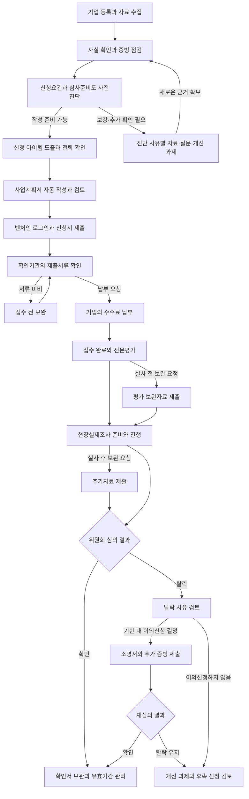

# 혁신성장유형 벤처확인 자동화 앱 — 서비스 기획 v1.5

작성일: 2026-09-22  
개정일: 2026-09-23  
개정 핵심: 사용자가 재확인한 최종 목적은 회사 자료를 넣으면 사전진단·아이템 도출·사업계획서 작성·등록·접수·보완·실사 준비·결과 대응·확인서 관리까지 이어지는 전 과정 자동화다. 이를 제품의 완료 기준으로 명시하고, 단계별 자동 진행·필요한 사용자 참여·실제 기관 상태 확인을 연결한다. [사전진단 기능설계](./혁신성장유형_사전진단_기능설계.md), [심사 중점·실사 준비 반영안](./혁신성장유형_심사중점_실사준비_반영안.md) 참고.  
기획 범위: 기업자료 수집부터 사업계획서, 신청, 납부 관리, 보완, 현장실제조사, 이의신청, 확인서 관리까지  
전제: 컨설팅 담당자가 여러 기업을 관리하고, 각 기업의 대표·담당자가 자료 제공과 사실 확인, 본인인증, 납부, 실사에 참여한다. 이번 문서는 후속 개발을 위한 기획이며, 아래 기능이 모두 구현됐다는 의미는 아니다.

## 1. 서비스의 중심

**회사 자료를 한 번 모아 입력하면 앱이 혁신성장유형 신청을 분석하고, 사업계획서 작성부터 등록·접수·보완·실사 준비·결과 대응·확인서 확보까지 전 과정을 이어서 수행·관리하는 것이 최종 목표다.** 회사의 특허·제품·개발내용·인력·사업자료에서 타당한 신청 아이템을 도출하고 증빙과 일치하는 사업계획서를 자동 완성하는 기능을 그 핵심으로 둔다.

사용자는 회원가입 또는 담당자의 초대를 통해 기업 작업공간에 들어오고, 안내된 보유자료를 한 번에 올린 뒤 필요한 질문에만 답한다. 기관의 본인인증·내용 확인·납부·현장 대응 등 기업이 참여해야 하는 순간에는 해당 작업만 알리고, 완료가 확인되면 다음 자동 처리로 이어간다. 기관의 최종 심사결과를 앱이 보장하지는 않는다.

### 1.1 자동 진행의 제품 기준

- 자료 업로드를 시작점으로 분류·추출·사전진단·부족 자료 요청·아이템 도출·초안 작성·검토를 작업 흐름으로 연결한다. 사용자가 모든 단계에서 별도의 실행 버튼을 누를 필요를 줄인다.
- 자료·답변·기관 요청이 추가되면 영향을 받는 진단·원고·증빙·답변을 찾아 다시 처리한다. 실제 제출본은 고정 보존하고 수정안은 새 버전으로 만든다.
- 원문 충돌이나 증빙 부족이 있으면 확인할 내용·이유·해결 방법을 알려준다. 서류만으로 해결할 수 없는 시험·고객 검증·발급은 실제 수행 과제로 요청한다.
- 신청서 입력·서류 첨부·제출·기관 상태 조회 자동화도 최종 범위에 포함한다. 실제 제공되는 연동수단·사용조건·인증 흐름을 검증한 뒤 구현하며, 현재 연동이 가능한 것으로 표시하지 않는다.
- 기관에 제출한 자료·신청 식별정보·수신 요청·납부·접수·결과를 연결한다. 실패 시 해당 단계에서 재개하고, 응답이 불명확한 제출은 공식 상태부터 확인해 중복 처리를 막는다.
- 기업은 현재 진행상태와 자신이 해야 할 일만 우선 확인한다. 컨설팅 담당자는 여러 기업의 지연·확인 필요·기한 임박 상황을 함께 관리한다.
- 서비스의 완료 기준은 개별 기능 작동을 넘어 실제 신청 건의 제출·보완·결과·확인서까지 처리 이력이 연결되는 것이다. 확인되지 않은 경우도 원인과 후속 과제를 기록한다.

### 1.2 기획과 현재 구현의 구분

현재는 기업별 자료 저장·추출, 아이템 분석·계획서 생성 경로, 원고 편집·검토·버전 보관, 실사 준비 안내·질문·업무 관리 기반을 구현했다. 실제 AI 생성 품질은 API 연결 후 검증해야 한다. 통합 사전진단 흐름, 문장별 증빙 검증, 단계 간 자동 진행, 회원가입·기업별 권한, 기관 자동 입력·첨부·접수·상태 조회, 알림·보완 대응·이의신청·확인서 자동 수집은 후속 개발 범위다.

기업자료 입력 → 혁신성장유형 신청 사전진단 → 부족한 정보 확인·자료 보강 → 신청 아이템 후보 도출·비교 → 추천 전략 확인 → 사업계획서 자동 작성 → 근거·수치·실행계획 검토 → 필요한 보강자료 반영 → 제출본 완성의 흐름이다. 사전진단은 기본요건 검토와 기술·사업의 심사준비도를 구분하며, 자료부족을 요건 미충족으로 판단하지 않는다. 확정한 사실과 근거를 이후 보완 답변·실사 준비·이의신청에서도 이어서 사용한다.

개발의 최우선 검증 대상은 아이템 추천의 타당성과 사업계획서 품질이다. 최종 심사결과를 보장할 수는 없으며, 앱의 완료 기준은 회사의 실제 역량·증빙과 일치하고 제출 전에 확인할 수 있는 누락·모순·근거 부족이 검토된 사업계획서다.

기업별로 하나의 신청 업무공간을 만들고, 사용자가 항상 다음 네 가지를 알 수 있도록 한다.

1. 지금 어떤 단계인가?
2. 무엇이 부족하고 어떤 근거를 추가해야 하는가?
3. 누가 언제까지 어떤 일을 해야 하는가?
4. 기관에 실제로 제출한 내용과 결과는 무엇인가?

혁신성장유형은 기술혁신성과 사업성장성을 평가하므로, 문장 작성과 함께 기술의 차별성·개발 역량·시장·실적을 입증하는 자료를 연결한다. 특허나 연구소를 모든 기업의 공통 필수조건으로 설정하지 않는다. [공식 유형 안내](https://www.smes.go.kr/venturein/institution/requireGuide?rgCd=C)

사업 목표는 누락·불일치·기한 경과를 줄이고 기업이 자신의 기술과 성장계획을 충분히 입증하도록 돕는 것이다. 기관의 최종 판단과 앱의 준비상태 판단은 구분한다.

## 2. 사용자와 권한

| 사용자 | 주요 역할 | 기본 화면 |
|---|---|---|
| 총괄 관리자 | 기업·담당자 배정, 기준·양식 버전 관리, 전체 일정 관리 | 전체 기업 현황 |
| 컨설팅 담당자 | 상담 분석, 자료 검토, 계획서 편집, 보완·실사 지원 | 기업별 업무공간 |
| 기업 대표 | 핵심 사업내용 확인, 본인인증, 최종 내용 확인, 실사 설명 | 내 기업의 할 일 |
| 기업 실무 담당자 | 서류 업로드, 수치 확인, 일정 조율, 권한 범위 내 납부 | 자료 요청·마감 목록 |

각 기업에는 담당자·최종 확인자·납부 담당자를 지정한다. 기업 간 자료 접근을 분리하고, 외부 공유 링크에는 대상 기업·허용 작업·유효기간을 둔다. 대표에게는 전체 관리도구 대신 지금 필요한 자료·확인·납부·실사 준비를 우선 보여준다.

## 3. 전체 진행 흐름

기관 절차에서는 신청서 제출 후 자료 확인을 거치며, 미비서류 보완이 납부 전에 발생할 수 있다. 납부완료가 접수완료다. 이후 전문평가와 현장실제조사, 위원회 심의를 거친다. 따라서 중간 단계에 ‘최종 통과’를 표시하지 않는다. [공식 확인절차](https://www.smes.go.kr/venturein/institution/processGuide)

위 흐름은 앱 설계안이다. 평가 중 보완 작업은 현재 단계에 붙는 별도 업무로 관리하고, 보완 때마다 이미 마친 실사를 자동으로 다시 예정하지 않는다.

## 4. 사용자가 제안한 9단계의 기능 설계

| 단계 | 앱이 처리할 일 | 기업·담당자가 할 일 | 다음 단계로 넘어가는 기준 |
|---|---|---|---|
| 1. 기업정보·자료 입력 | 녹취 전사, 문서 분류, 기업정보 추출, 누락·불일치 탐지, 맞춤 질문 생성 | 자료 제공, 잘못 추출된 수치와 사실 확인 | 적용 경로와 핵심 사실 확정, 부족한 자료 목록 생성 |
| 2. 아이템 도출·사업계획서 자동 작성 | 보유·개발 중 기술의 신청 후보 비교, 기업별 추천 전략, 평가항목별 원고 자동 작성, 근거·수치 검토, 보완 후 재작성 | 추천 전략과 실제 사업의 일치 확인, 필요한 추가 답변, 최종 내용 확인 | 핵심 쟁점 검토 완료, 제출할 버전과 첨부파일 목록 확정 |
| 3. 벤처인 연결 | 공식 사이트 이동, 로그인 상태 및 해당 기업 확인 지원 | 기업 사용자의 직접 로그인·본인인증 | 올바른 기업 계정의 이용 상태 확인 |
| 4. 신청서·서류 등록 | 항목별 입력자료와 제출파일 준비, 허용된 연동 범위에서 입력·첨부, 제출 결과 기록 | 최종 신청내용 확인과 필요한 인증 | 공식 제출 결과·신청 식별정보 확보 |
| 5. 납부·접수 관리 | 접수 전 보완 관리, 납부 요청·금액·기한 정리, 담당자 알림, 납부 결과 확인 | 공식 사이트에서 수수료 납부 | 기관의 접수완료 상태 확인 |
| 6. 전문평가·보완 | 기관 요청을 질문별 과제로 분해, 추가 자료 요청, 답변 초안, 수정 전후 비교 | 근거 제공, 답변 검토 | 각 요청의 제출 결과 확인, 남은 요청 추적 |
| 7. 실사 준비·진행 | 일정, 예상 질문, 근거자료 목록, 설명자료, 시연 점검, 모의 질의응답 | 실제 제품·현장·인력 준비와 사실에 근거한 설명 | 실사 진행 기록 및 후속 요청 정리 |
| 8. 결과·이의신청 | 결과 원문 저장, 탈락 사유 분석, 기한 관리, 사유별 소명서와 증빙 구성 | 이의신청 여부 결정, 소명 내용 확인 | 확인 결과 또는 재심의 결과 확보 |
| 9. 확인서·후속 관리 | 확인서 보관, 유효기간 기록, 제출자료 보존, 다음 재확인 준비 안내 | 확인서 정보 확인, 이후 성과자료 축적 | 확인서 검증 완료 또는 미확인 건의 후속 과제 기록 |

3~4단계의 자동 연동은 기관의 허용 범위와 실제 화면을 검증한 뒤 제공한다. 연동되지 않은 상황에서도 사용자가 항목별 내용을 복사하고 파일 묶음을 내려받아 신청을 끝낼 수 있게 한다.

## 5. 1단계 — 어떤 자료를 받아야 하는가

처음부터 모든 기업에 같은 파일을 전부 요구하지 않는다. 기업정보와 보유자료를 먼저 받고, **공통 제출자료 / 기업 조건에 따른 제출자료 / 평가내용을 입증하는 보강자료**를 구분해 요청한다.

### 5.1 최초 등록에서 받을 정보

- 회사명, 사업자등록번호, 법인·개인 구분, 설립일, 소재지, 업종, 대표·담당자 연락처.
- 신규·재확인 여부, 기존 확인서와 유효기간, 신청 예정일.
- 보유하거나 개발 중인 기술·제품, 고객, 해결하는 문제, 개발 단계, 주요 매출원. 신청 아이템이 정해지지 않았으면 자료 분석 후 후보를 도출한다.
- 현재 보유한 서류와 자료 제공 담당자.

설립일·신청 기준일과 재확인 여부를 바탕으로 신규 3년 미만 / 신규 3년 이상 / 재확인 준비 경로를 안내한다. 제도 기준일과 예외는 실제 신청 기준에 맞춰 확정한다. 명단의 확인시작일을 설립일로 사용하지 않는다.

### 5.2 자료함 구성

| 자료함 | 입력자료 예시 | 추출·활용할 내용 |
|---|---|---|
| 상담·인터뷰 | 상담 녹음, 녹취록, 메모, 대표 답변 | 사업 동기, 기술 설명, 고객 문제, 개발 이력, 미확인 주장 |
| 기업 기본 | 사업자등록증, 해당 시 법인등기·주주명부, 중소기업확인 정보 | 기업 식별, 대표, 업력, 신청조건 |
| 재무·고용 | 해당 기간 재무제표·감사보고서, 부가세 과세표준증명, 고용·보험 명부 | 매출, 연구개발비, 고용, 기간별 변화 |
| 기술·연구 | 기술설명서, 제품자료, 설계도, 개발 기록, 시험·검증자료, 보유 특허·연구조직 자료 | 기술 차별성, 개발 역량, 진행한 연구개발과 그 근거 |
| 시장·사업 | 계약·발주·납품자료, 고객 검증, 판매·수출 실적, 시장조사, 경쟁제품 정보 | 시장 수요, 진입 전략, 실제 성과 |
| 인력·협업·자금 | 대표·핵심인력 경력, 협업 자료, 보유자금 및 조달 근거 | 수행 역량, 외부 협력, 계획의 실행 가능성 |
| 재확인 | 이전 신청서·확인서·보완 이력, 확인기간 동안의 개발·사업성과 | 기존 계획 대비 변화와 지속적인 혁신 활동 |

공식 제출 여부와 보강자료 여부는 각각 표시한다. 공식 안내에 있는 자동연계 자료는 연계 상태를 확인해 중복 요청을 줄이고, 서류별 대상·기간·발급일·대체자료 조건은 기준 버전별로 관리한다. [공식 제출서류 안내](https://www.smes.go.kr/venturein/institution/requireGuide?rgCd=C)

### 5.3 자료 입력 후의 자동 처리

1. 파일을 분류하고, 음성은 전사하며, 문서에서 텍스트·표를 추출한다.
2. 추출한 정보마다 원본 문서의 페이지 또는 녹취 시점을 연결한다.
3. 기업명·사업자번호·날짜·매출·인원 등이 다른 자료와 일치하는지 검사한다.
4. 모호한 발언과 실제 증명자료를 구분한다. 낮은 인식 신뢰도와 충돌한 수치는 검토 대상으로 남긴다.
5. 부족한 항목별로 기업에 보낼 질문과 자료 요청 초안을 만든다.

예를 들어 상담에서 ‘기존 제품보다 처리시간이 줄었다’고 말했다면, 비교 조건·측정 방법·시험 결과가 있는지 확인한다. 근거가 없을 때는 질문을 생성하고 해당 주장을 미확인으로 표시한다.

문서·이미지·음성 형식은 실제 고객 파일로 인식률을 검증해 지원한다. HWP/HWPX 등 변환이 필요한 형식은 변환 결과 확인과 대체 업로드 경로를 마련한다. 자료 제공·AI 처리에 필요한 동의를 기록하고 기업별 접근권한과 보관기간을 둔다.

## 6. 2단계 — 아이템 도출과 사업계획서 자동 작성

이 단계가 앱의 최우선 기능이다. **회사의 보유기술과 실제 개발·사업내용에서 신청 주제를 도출하고, 기술의 차별성이 고객의 구매 이유와 성장계획으로 이어지도록 작성한다.** 자료가 충분하면 후보 2~3개를 비교하되, 근거 없는 후보를 억지로 늘리지 않는다.

후보마다 고객 문제, 핵심 기술, 특허와의 관계, 현재 개발 단계, 비교 대상, 차별성 근거, 시장·사업화 경로, 인력·자금, 부족한 자료, 추천 이유를 제시한다. 출원·등록 및 권리자·실시권 근거를 구분하고 특허 제목만으로 제품 전체의 기술력이나 독점성을 단정하지 않는다.

현재 신청 아이템과 향후 신규 개발 제안을 구분한다. 미래 계획은 기업이 실제로 추진할 의사·인력·자금과 함께 검토하며, 미개발 기능이나 목표 수치를 현재 보유기술·달성 실적으로 작성하지 않는다. 매출이나 완성품이 없다는 이유만으로 초기 기업을 일률적으로 제외하지 않는다.

작성 뒤에는 별도 검토 과정에서 근거의 적합성, 자료 충돌, 기술과 시장의 연결, 계획 수치·일정·자금의 일관성, 실사 설명 가능성을 확인한다. 부족한 사실은 기업에 묻고 새 증빙을 반영해 다시 작성한다. 자료 없이 표현만 강화하는 반복은 피한다.

세부 기능·품질 기준·예시는 [아이템 도출·사업계획서 자동작성 상세기획](<C:/Users/usr/OneDrive/바탕 화면/codex/벤처확인자동화앱개발/기획/아이템도출_사업계획서자동작성_상세기획.md>)을 기준으로 한다.

산출물은 **벤처인 온라인 입력 항목별 원고 + 검토용 통합본 + 증빙 목록**이다. 공식 사업계획서는 온라인 작성 항목이 있으므로, 파일 한 개를 완성하는 것만으로 신청 준비가 끝났다고 판단하지 않는다. [공식 유형 안내](https://www.smes.go.kr/venturein/institution/requireGuide?rgCd=C)

사용자 제공 2026 가이드북의 사업계획 설명과 평가항목을 바탕으로 다음 구조를 기본안으로 한다. 실제 항목명·분량·첨부 규격은 신청화면을 확인해 고정한다.

| 작성 영역 | 작성 내용 | 검토 초점 |
|---|---|---|
| 개발 필요성과 해결방식 | 고객의 문제, 기존 방식의 한계, 신청기술의 해결방식 | 문제가 구체적이고 기술과 연결되는가 |
| 기술 차별성 | 비교 대상, 차이, 성능·기능·비용 등의 비교 근거 | 검증할 수 있는 차별성인가 |
| 기술개발과 수행 역량 | 개발 경과, 향후 계획, 인력, 연구개발 실적·투자·지식재산 | 실제 성과와 앞으로 할 일을 구분했는가 |
| 시장과 사업화 | 목표시장, 고객, 경쟁사, 진입전략, 협업 | 출처·기준일과 실제 고객 근거가 있는가 |
| 자금과 실행계획 | 개발·사업화 일정, 소요자금, 확보·조달계획 | 매출 목표·인력·비용·일정이 서로 맞는가 |
| 재확인 성과 | 기존 확인기간의 혁신 활동과 사업성과 | 이전 제출내용과 성과자료를 연결했는가 |

### 작성 화면

- 왼쪽: 작성 항목과 준비상태.
- 가운데: 사업계획서 편집기.
- 오른쪽: 해당 문장의 근거자료·원본 위치·추가 질문.
- 하단: 담당자 검토 의견, 수정 이력, 이번 변경이 영향을 주는 다른 항목.

### 작성 규칙

- 기업의 실제 사실, 기업이 제시한 목표, 외부 조사자료, AI 제안 내용을 구분한다.
- 숫자는 기준연도·단위·기간·출처와 함께 관리한다. 미래 전망은 가정을 표시한다.
- 특허·시험결과·협업·계약·매출 등은 실제 자료가 있을 때 실적으로 기재한다.
- 불명확한 내용은 빈칸 또는 ‘확인 필요’로 남기고 후속 질문을 만든다.
- 원본자료가 바뀌면 관련 문단을 찾아 재검토 대상으로 표시한다.
- 최종 확인된 문안과 첨부파일을 한 버전으로 묶어 보존한다. 이후 보완은 새 버전으로 관리한다.

준비상태는 ‘자료 없음 / 자료 있음·검토 필요 / 근거 확인 / 불일치·추가 확인’으로 보여준다. 근거 없는 합격확률이나 임의의 합격점수를 표시하지 않는다.

## 7. 3~5단계 — 로그인·등록·접수·납부

### 7.1 연동 방식의 기본안

사용자는 벤처인 ID·비밀번호를 기업별로 한 번 입력해 두면 앱이 로그인·신청서 등록·첨부·제출까지 이어서 처리하는 방식을 요청했다. **저장 계정 기반 자동 진행을 제품 요구로 반영한다.** 비밀번호를 기업자료·AI 입력·일반 로그에 넣지 않고 별도 비밀 저장소에 암호화하며, 계정 변경·삭제와 연결 종료를 지원한다. 추가 인증이 발생하면 해당 인증만 기업 사용자가 처리한 뒤 자동 진행을 재개하는 흐름으로 설계한다.

2026-09-23 공개 로그인 화면에서 아이디·비밀번호 폼과 공동인증서 로그인 경로를 확인했고, 공식 홈에는 2차 인증 관련 안내도 게시되어 있다. 따라서 ID·비밀번호만으로 모든 계정의 인증이 끝난다고 보장하지 않는다. 현재 벤처인 약관 제20조는 계정의 제3자 이용 및 사전 승낙 없는 영리행위에 관한 제한을 두므로 상용 서비스의 연동 범위를 기관과 확인해야 한다. [공식 로그인](https://www.smes.go.kr/venturein/auth/viewLogin), [벤처인 이용약관](https://www.smes.go.kr/venturein/cmmn/terms)

현재 로컬 Windows 구현은 기업별 DPAPI 암호화 저장, 별도 임시 Edge 창의 자동 로그인 시도, 추가 인증 이후 로그인 표시 확인까지다. 계정 저장과 로그인 성공, 로그인 성공과 신청기업 일치, 신청기업 일치와 제출 완료를 각각 구분한다. 작성본·첨부 원본 목록은 연결 준비 화면에 표시하되 실제 공식 항목·첨부 규격·동의·제출 결과 화면을 검증하기 전에는 자동 제출을 실행하지 않는다. 실제 계정 통합 검증이 남아 있다.

| 수준 | 제공 기능 | 적용 조건 |
|---|---|---|
| 기본 제출 지원 | 공식 사이트 링크, 항목별 복사, 제출파일 묶음, 입력순서 안내 | 앱 내부에서 먼저 구현 가능한 범위 |
| 입력·첨부 지원 | 사용자가 로그인한 환경에서 기업정보·사업계획 입력과 파일 첨부 지원 | 허용 범위, 인증 흐름, 화면·파일 규격 검증 후 |
| 공식 연계 | 허용된 API 또는 협의된 연동을 통한 제출·상태 확인 | 실제 연계수단과 사용조건 확보 후 |

앱 안에 벤처인 화면을 그대로 삽입할 수 있다고 가정하지 않는다. 별도 공식 사이트 창에서 저장 계정으로 로그인하고 필요한 추가 인증을 사용자가 처리하게 한다. 비밀번호·인증코드·세션 비밀값을 AI 입력이나 일반 로그에 넣지 않는다.

### 7.2 자동 입력·첨부에 필요한 검증

- 신청 기업과 로그인 기업이 같은지 확인한다.
- 입력 대상 필드, 글자 수, 필수값, 파일 형식·용량 조건을 확인한다.
- 입력한 값과 업로드된 파일명을 다시 확인한 뒤 제출 미리보기를 제공한다.
- 최종 확인된 버전을 제출하고, 기관의 결과 화면·신청 식별정보·제출시점을 기록한다.
- 인증 만료나 업로드 실패 시 현재 상태를 보존해 재개한다.
- 제출 도중 응답이 끊기면 기관의 실제 상태부터 확인한다. 중복 제출·중복 납부로 복구하지 않는다.
- 연동이 막히면 현재 자료를 내려받아 직접 처리하고 결과를 기록할 수 있게 한다.

### 7.3 납부와 알림

납부 요청이 확인되면 ‘납부할 기업·공식 금액·기한·납부 담당자·공식 이동 경로’를 한 화면에 보여준다. 결제는 기업이 공식 사이트에서 수행하며, 납부 완료를 기관의 접수 상태와 대조한다. 앱 이용료가 생기더라도 벤처확인 수수료와 구분한다.

기관의 수신 알림과 앱이 보내는 업무 알림을 분리한다. 공식 절차 안내는 납부 요청과 결과의 문자 안내를 명시하고 있으므로, 모든 알림이 이메일로도 도착한다고 가정하지 않는다. [공식 확인절차](https://www.smes.go.kr/venturein/institution/processGuide)

초기에는 사용자가 받은 문자·메일을 전달하거나 내용을 등록하고, 이후 동의한 메일 연동과 허용된 상태 조회를 붙인다. 대표 휴대전화로 온 문자를 서버가 자동으로 읽을 수 있다고 가정하지 않는다. 메시지를 분석해 기한과 할 일을 제안하되, 회사·신청 식별정보와 공식 상태를 대조한다.

알림 대상은 담당자로 지정된 사람이며, 새 할 일·기한 임박·작업 실패·결과 변경에 집중한다. 앱은 발송과 실제 확인을 구분해 기록하고, 확인되지 않은 중요한 업무는 총괄 담당자가 볼 수 있게 한다.

## 8. 6단계 — 보완 요청 처리

보완은 ‘접수 전 서류 미비’, ‘평가 중 추가 확인’, ‘실사 후 요청’, ‘이의신청 중 보완’으로 구분한다. 같은 파일을 다시 올리는 것으로 완료되지 않도록 기관 요청 하나마다 처리 내역을 관리한다.

보완 요청에는 다음 정보를 저장한다.

| 항목 | 내용 |
|---|---|
| 기관 요청 | 원문, 수신일, 제출기한, 요청기관·담당 정보 |
| 연결 항목 | 사업계획서 문단, 평가항목, 기존 증빙 |
| 대응안 | 추가 설명, 수정할 내용, 확보할 자료 |
| 담당 | 자료 제공자, 답변 작성자, 최종 확인자 |
| 제출 결과 | 제출 버전, 첨부파일, 실제 제출시점·상태 |

AI는 요청을 요약하고 관련 자료를 찾은 뒤 답변 초안을 작성한다. 추가 증빙이 없으면 확보할 자료와 이유를 제시한다. 제출 후 기관의 수용 여부가 확인되기 전에는 ‘보완 제출’ 상태로 남긴다.

예시: 기술 우위의 근거가 부족하다는 요청을 받으면, 비교 대상·비교 조건·보유 시험자료·설명 문단을 연결한 표를 만들고 실제 자료로 답변을 구성한다. 신청기술의 범위가 달라지는 수정은 별도 검토 대상으로 표시한다.

## 9. 7단계 — 실사 준비

실사는 제출한 기술과 사업내용을 실제 현장·사람·자료로 설명할 수 있도록 준비한다.

- 제출본 기반 예상 질문과 각 질문의 근거자료 링크.
- 대표·기술책임자·실무 담당자별 설명할 내용.
- 기술·제품 시연 순서, 필요한 환경, 실행 점검표.
- 인력·연구개발·사업성과를 확인할 자료의 위치와 담당자.
- 사업계획서 수치와 대표 답변이 다른 부분의 사전 점검.
- 짧은 기업 설명자료, 기술 비교표, 자료 색인.
- 실사 일정·장소·참석자와 기관이 요청한 준비사항.
- 실사 후 질문·답변·추가 제출 약속과 기한 기록.

모의 질의응답에서는 답변의 일관성과 근거 유무를 확인한다. 예시 질문은 준비용이며 실제 기관 질문을 미리 알고 있다고 표시하지 않는다. 평가기관이 별도로 지정한 준비사항을 우선 반영한다.

## 10. 8~9단계 — 결과·이의신청·확인서

### 확인된 경우

결과 원문과 확인서를 보관하고 기업명·확인유형·유효기간을 확인한다. 제출본·보완본·실사 기록을 해당 신청 건에 연결하며 다음 재확인에 사용할 성과자료를 이후부터 축적한다.

### 탈락한 경우

사유별로 ‘기관 판단 → 기존 설명·자료 → 부족한 소명 → 추가 근거 → 이의신청 문안’을 작성한다. 담당자와 기업이 이의신청 여부를 결정하고, 결정하지 않은 동안에도 기한을 표시한다.

공식 안내에 따라 이의신청은 결과 통보일부터 30일 이내에 진행하며, 본심의 탈락 사유를 객관적으로 소명하는 자료가 중심이다. 신청 기술 변경은 불가하다. 기한 종료 후 재접수가 불가능하므로 자동 취소 후 재신청을 복구 방식으로 사용하지 않는다. [공식 이의신청 안내](https://www.smes.go.kr/venturein/myVntr/viewAplyObjcGuide)

앱에서는 다음을 별도로 관리한다.

- 결과 통보일의 근거와 실제 이의신청 기한. 불명확하면 담당자 확인 과제로 둔다.
- 탈락 사유마다 소명 문장과 추가 증빙이 연결됐는지 여부.
- 최초 신청기술과 이의신청 문안의 일관성.
- 이의신청 제출, 보완 요청, 필요한 기한 연장 신청, 재심의 대기, 결과.
- 기관의 ‘이의신청 승인’이 재심의 상정 단계인 경우 이를 최종 벤처확인으로 표시하지 않는 상태 매핑.

재심의 후 탈락이 유지될 수 있으므로, 마지막 상태는 ‘확인서 발급’ 또는 ‘미확인 종료·개선 과제’로 구분한다. 이후 신청은 당시 기준과 기업 상황을 검토해 새 신청 건으로 관리한다.

## 11. 필요한 화면

| 화면 | 핵심 구성 |
|---|---|
| 전체 현황 | 기업별 진행단계, 담당자, 가장 가까운 기한, 지연·확인 필요 업무 |
| 기업 업무공간 | 신청 경로, 현재 상태, 오늘 할 일, 최근 기관 알림 |
| 자료함·상담 분석 | 파일·녹취, 분류, 추출 내용, 원본 위치, 자료 요청 |
| 신청 아이템·전략 | 기술 후보 비교, 추천 이유, 현재 역량과 증빙, 보강 과제, 전략 확인 |
| 평가 준비현황 | 기술혁신성·사업성장성 항목, 증빙, 불일치, 추가 질문 |
| 사업계획서 | 항목별 편집, 근거 확인, 버전 비교, 최종 검토 |
| 벤처인 신청 | 입력용 원고, 첨부목록, 로그인·연동 상태, 제출 결과 |
| 접수·보완 | 납부, 기관 요청, 담당자·기한, 답변·제출 기록 |
| 실사 준비 | 일정, 예상 질문, 시연, 담당자, 현장자료 색인 |
| 결과·이의신청 | 결과 원문, 사유 분석, 소명서·추가자료, 재심의 상태 |
| 확인서·이력 | 확인서, 유효기간, 과거 신청본, 재확인 준비 |

알림을 누르면 해당 기업의 바로 처리할 업무로 이동한다. 예를 들어 ‘자료 추가 필요’는 자료 요청 카드로, ‘납부 필요’는 공식 납부 경로가 있는 카드로 연결한다.

## 12. 내부 데이터와 개발 구조

화면은 기존 **Next.js + Tailwind CSS + shadcn/ui** 기반을 유지한다. 이미 설치한 React Hook Form·Zod는 입력 검증, TanStack Query·Table은 조회와 기업 목록에 활용한다. 새로운 외부 서비스·라이브러리는 실제 파일 인식 품질, 비용, 운영환경, 데이터 처리조건을 비교한 뒤 선정한다.

| 내부 구성 | 역할 |
|---|---|
| 기업·사용자·권한 | 조직, 기업, 담당자, 접근 범위 관리 |
| 신청 건 | 신규·재확인, 적용 기준, 단계, 기관 신청 식별정보 |
| 자료·사실·근거 | 원본 파일, 추출값, 검토 상태, 페이지·녹취 위치 |
| 신청 아이템·전략 | 후보와 비교 근거, 특허·제품·고객 연결, 선정 이유, 현재 상태와 미래 계획 |
| 사업계획서 버전 | 문단, 관련 사실, 수정 의견, 제출 확정본 |
| 요청·할 일·기한 | 자료 요청, 기관 보완, 실사, 납부, 이의신청 |
| 제출·외부 처리 이력 | 입력·첨부·제출한 버전, 기관 결과, 실패·재개 기록 |
| 기준·서식 버전 | 평가 경로, 제출자료 조건, 온라인 항목, 검토 출처·일자 |

서버 DB와 파일 저장소를 두고 기업자료를 브라우저 저장에만 의존하지 않도록 전환한다. 음성 전사·문서 추출·초안 생성은 재개 가능한 작업으로 실행하고, 실패한 단계만 다시 처리한다. 원본은 보존하고 추출 결과와 AI 작성본을 구분한다.

로그인·제출을 담당하는 외부 연동 부분과 내부 자료·사업계획서 기능을 분리해, 벤처인 화면 변경이 문서 작업까지 중단시키지 않도록 한다. 실제 제출의 성공 여부는 버튼 클릭 성공이 아니라 기관의 상태와 제출 결과로 판단한다.

기업자료의 암호화, 기업 간 접근 차단, 공유 권한, 자료 삭제·보관 정책, 필요한 개인정보 마스킹, 변경 이력을 설계에 포함한다. 다른 기업의 자료를 동의 없이 답변·사업계획서 생성에 재사용하지 않는다.

## 13. 개발 순서와 완료 기준

최종 목표는 서류 입력에서 결과·확인서 관리까지 이어지는 전 과정 자동화다. 구현은 다음 순서로 진행하되, 초기 수동 상태 기록은 자동 연동 검증 전의 중간 구현으로 구분한다. 단계들을 이어 실행하는 작업 흐름과 기관 연결 검증을 함께 진행한다.

| 순서 | 구현 범위 | 완료 판단 기준 |
|---|---|---|
| 선행 검증 — 병행 진행 | 최신 신청화면·서류 조건, 계정·상업적 연동 허용 범위, 파일 규격과 알림 경로 확인 | 검증된 연동 범위와 대체 처리방법이 문서로 정리됨 |
| 1차 제품 | 다중 기업 관리, 사용자 권한, 자료 업로드·녹취 분석, 아이템 도출·전략 추천, 사업계획서 자동 작성·검토·재작성, 전체 단계·기한 기록, 제출자료 내보내기 | 기업의 실제 기술과 연결된 신청 아이템을 추천하고, 근거와 수치가 검토된 제출용 원고를 자동 작성하며 원본까지 추적 가능 |
| 2차 제품 | 허용된 로그인·입력·첨부 지원, 제출 확인, 접수·납부 상태 연결, 기관 알림을 할 일로 전환 | 직접 처리와 연동 처리 모두 제출 결과를 보존하며 실패·재개 시 중복 제출하지 않음 |
| 3차 제품 | 보완 답변 지원, 실사 모의 질문·자료 묶음, 이의신청 소명, 확인서·재확인 관리 자동화 | 사유별 근거와 기한을 끝까지 추적하고 최종 결과를 정확히 기록 |
| 고도화 | 업종별 질문과 근거 예시, 실제 보완·결과를 반영한 템플릿 개선 | 사례 검토를 통해 누락·수정 부담 감소를 확인 |

초기 검증 기업은 제조업과 소프트웨어 등 사업구조가 다른 기업을 포함하고 신규 3년 미만·3년 이상·재확인을 각각 확인한다. 의도적으로 자료가 부족한 사례와 수치가 충돌하는 사례도 포함한다.

운영 지표는 계획서 작성·수정 시간, 근거가 없는 문장 수, 자료 누락과 불일치 해결률, 기한 내 처리율, 연동 성공·복구율로 시작한다. 실제 확인 결과와 보완 사유는 맥락과 함께 기록하되 임의의 합격확률로 환산하지 않는다.

## 14. 기존 명단 분석을 활용하는 방법

2026년 8월 명단 분석상 혁신성장유형 기록은 26,525건이며, 제조업 63.51%, 정보처리·소프트웨어 관련 업종 17.60%, 재확인 58.26%였다. 이를 초기 업종별 질문과 재확인 자료관리의 우선순위 근거로 활용한다.

해당 명단에는 실제 제출 사업계획서·심사의견·탈락기업 자료가 없으므로, 유사기업 검색 결과를 성공한 신청서나 합격 원인으로 표시하지 않는다. 확인기업의 분포와 개별 신청기업의 준비상태를 구분한다.

분석 근거: [혁신성장유형 명단 분석보고서](<C:/Users/usr/OneDrive/바탕 화면/codex/벤처확인자동화앱개발/outputs/venture-202608/혁신성장유형_분석보고서.md>).

## 15. 근거와 미확정 사항

### 확인한 근거

- 사용자 제공 2026 벤처기업확인제도 가이드북: 인쇄 27쪽 평가항목, 28쪽 혁신성장 제출서류, 34~35쪽 사업계획 설명, 36쪽 심의 중점사항. PDF 파일 페이지와 인쇄 페이지가 다르므로 인쇄 쪽을 기준으로 표기했다.
- [공식 혁신성장유형 안내](https://www.smes.go.kr/venturein/institution/requireGuide?rgCd=C)
- [공식 확인절차](https://www.smes.go.kr/venturein/institution/processGuide)
- [공식 이의신청 안내](https://www.smes.go.kr/venturein/myVntr/viewAplyObjcGuide)
- [벤처인 이용약관](https://www.smes.go.kr/venturein/cmmn/terms)

웹 확인일: 2026-09-22. 이 문서의 화면·AI 처리·역할·개발순서·검증방법은 위 제도를 바탕으로 제안한 제품 설계다.

### 구현 전에 검증할 사항

- 기업 계정 종류, 대리·담당자 권한, 로그인·인증·서명 단계와 상업적 연동 허용 범위.
- 실제 제공되는 API 또는 공식 협의 가능한 연동수단의 존재와 이용조건.
- 신청화면의 최신 항목·글자 수·파일 규격·자동연계·서류 예외 조건.
- 접수·보완·결과 상태를 조회할 수 있는 범위와 실제 기관 알림 방식.
- 수수료와 기한의 실제 적용값. 기관 화면·고지 내용을 저장하고 기준 변경을 관리한다.
- 녹음·스캔·표·한글문서의 인식 품질과 AI 처리 서비스의 데이터 보관 조건.

현재 구현된 기업별 스튜디오·자료 저장·아이템 분석·원고·실사 준비 기반을 전 과정 자동화로 확장한다. 다음 개발은 **자료 입력 → 사전진단 → 부족 자료 보강 → 아이템 도출 → 자동 작성·검토**를 하나의 흐름으로 통합하고, 기관 입력·첨부·접수·상태 확인의 실제 연동 검증을 병행한다. 개발 완료 범위는 이 문서 1.2와 `web/README.md`, `web/VALIDATION.md`를 구분해 확인한다.
